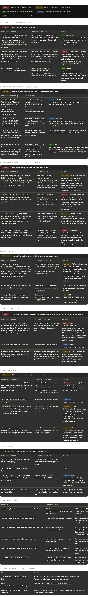

### F*CKED Up Explorer system

See my explorer system is all fucked read the markdown files and the image i attached. After youre done go over the rest of the files i attached, those are all the files i could find regarding the explorer system ( even if i missed some its fine besause it will soon all be redundant code after this ) and then delete create update the files/functions/folders names types order directory what ever you need to build a straight forward industry standard explorer system that follows the philosophy of data injection and psuedo pure functions. Go! ( P.S. After youre done please update AGENTS.md and EXPLORER.md and remove any redundencies )

### New Explorer Blueprint

---

stores/explorer/ ← reactive $state only, zero IO
explorer.state.store.svelte.ts ← selection, search, UI state

services/explorer/ ← runtime orchestration
createFileTree.svelte.ts ← WebContainer FS reader + auto-refresh
createProjectSync.svelte.ts ← Convex + Liveblocks sync

utils/explorer/ ← pure utilities  
 file-tree.ts ← readDirRecursive, createSignature, etc.
file-system.ts ← nodesToFileSystemTree, path helpers
explorer-ops.ts ← filter, expand, validate (move from explorerTreeOps)

hooks/
useExplorer.svelte.ts ← $effects + mount/cleanup (keyboard, pointer, bootstrap)

controllers/
ExplorerController.svelte.ts ← assembly root; flat API consumed by Explorer.svelte

components/explorer/ (or activities/)
Explorer.svelte ← wiring root; calls createExplorerController, onMount

---
